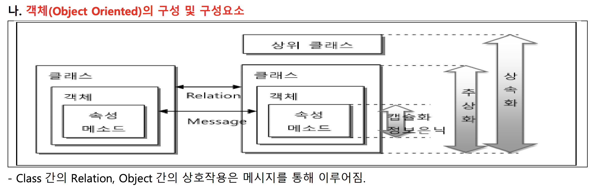
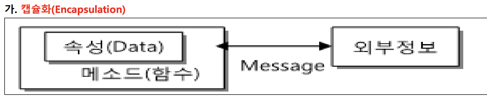
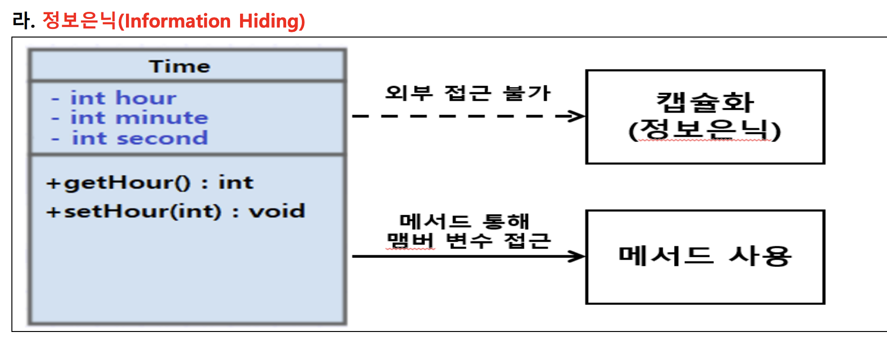
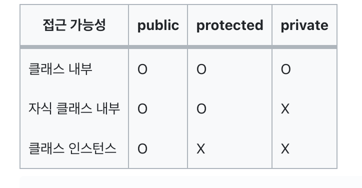
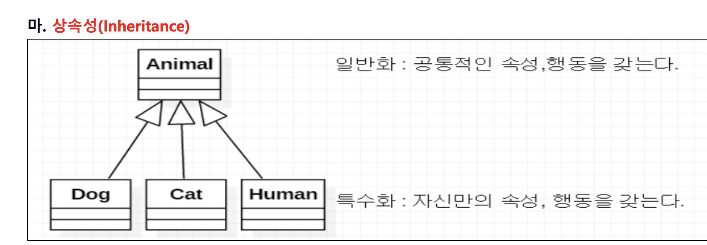

# 객체지향
### 객체지향의 정의
- 현실 세계에서 개체(Entity)를 속성(Attribute 또는 Property) 과 메소드 (Method)를 결합한 형태의 객체(Object) 로 표현하는 개념
- 구현해야 하는 대상을 하나의 객체로 보고 그 객체와 다른 객체들간의 관계로서 S/W를 모델링하는 개발방법론
> 

#### 구성요소 살펴보기 (this_is_class.ts 참조)
1. 클래스 (Class)
   * 객체의 타입을 정의하는 템플릿
2. 객체 (Object)
    * 클래스의 인스턴스
    * 실제로 메모리상에 할당된 실행 객체
3. 메소드 (Method)
   * 클래스로부터 생성된 객체에 명령을 내리는 방법
   * 즉 어떠한 행위/행동을 표현하는 방법이라 볼 수 있다.
   * 쉽게 표현하면 클래스의 **"함수"**
4. 프로퍼티 (Property)
   * 클래스로부터 생성된 객체가 가지고 있는 속성/값/성질
   * 쉽게 표현하면 클래스의 **"변수"**

### 객체지향 프로그래밍의 특징
1. 캡슐화 (encapsulation.ts 참조)
   * 정의
     * 객체의 프로퍼티와 메소드를 하나로 묶어 관리하고 
     * 객체의 중요한 정보는 외부에 노출하지 않기 위한 방법 (정보은닉)
        > 
   * 장점
     * 재사용성 증대 -> 생산성 증가
     * 결합도를 낮춤 -> 유지보수 용이
2. 추상화 (abstraction.ts 참조)
   * 정의
     * 현실세계의 사물(물체) 즉, 객체를 공통적인 속성과 기능으로 묶는 기법
     * 공통 성질을 추출하여 부모클래스를 설정
       > 
   * 장점
     * 복잡한 프로그램을 단순하게 만들 수 있음
3. 다형성 (polymorphism.ts 참조)
   * 정의
     * 가리키는 객체의 특성에 따라 수행하는 객체의 행위가 여러형태로 구성될 수 있는 성질
     * 같은 메소드 이름으로 여러 개의 다른 행위를 하는 메소드를 만들 수 있는 성질
   * 오버로딩 (Overloading) 과 오버라이딩 (Overriding)
     * 오버로딩: 하나의 클래스 내에서 같은 이름의 메소드를 여러개 가지면서 매개변수의 유형과 개수를 다르게 사용하는 기법
     * 오버라이딩: 상속관계에 있는 두 클래스에서 부모 클래스가 가지고 있는 메소드를 자식클래스가 재정의 하는 기법 
     * overriding.ts 참조
     * [링크참조](https://www.zerocho.com/category/JavaScript/post/59c17a58f40d2800197c65d6)
   * 장점
     * 확장성과 유연성 증대
4. 정보은닉 (information_hiding.ts 참조)
   * 정의
     * 캡슐화 방법으로 클래스 내부의 정보를 은닉하고 접근 제한의 단계를 두어 보안적 기능을 구현하는 기법
     * 복잡한 부분은 클래스 내부에 감추고 외부에는 추상화된 기능만 제공하는 성질
       > 
   * 접근제어자 (Private, Protected, Public)
     * Private: 클래스 내부에서만 참조 가능
     * Protected: 클래스 내부 + 상속받은 관계에서만 참조 가능
     * Public: 어느곳에서나 참조 가능
       > 
     * access_control.ts 참조

5. 상속 (inheritace.ts 참조)
   * 정의
     * 이미 정의된 상위 클래스의 특징을 하위클래스가 물려받는 성질
       > 
   * 장점
     * 코드 중복을 제거하고 재사용성을 높임

